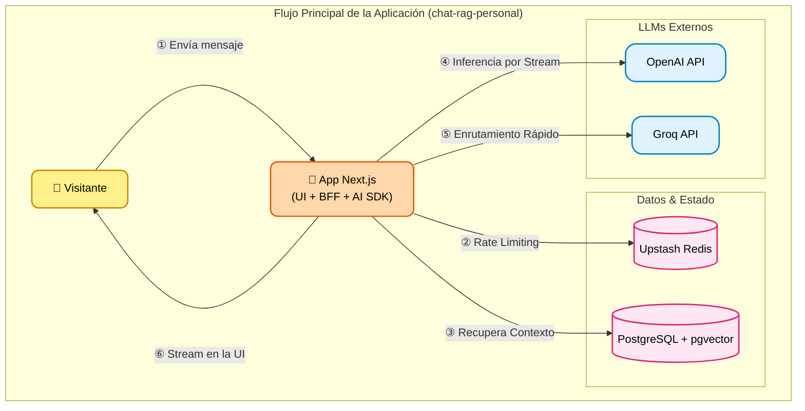

<div align="center">
  
  <h1>mAIo Assistant Chat</h1>
  <p><strong>La experiencia definitiva de portafolio interactivo guiada por Inteligencia Artificial.</strong></p>

  []()
  []()
  []()
  []()
  
  <br />
  <a href="https://maio.maioli.dev.br" target="_blank"><strong>🔗 Accede a mAIo Assistant Chat en vivo</strong></a>
  <br /><br />
   <a href="README.md">English (en-US)</a> |  <a href="README.pt-BR.md">Português (pt-BR)</a> |  <a href="README.es-LA.md">Español (es-LA)</a>
</div>

---

Bienvenido a **mAIo Assistant Chat**, el portafolio interactivo de **Irineu Marcelo Maioli**. Más que una simple página de currículum, este proyecto representa una visión orientada al futuro de cómo interactuamos con identidades profesionales en línea.

A través de **mAIo** (Inteligencia Artificial del Portafolio Maioli), visitantes, reclutadores y desarrolladores pueden conversar con una IA entrenada para presentar mi trayectoria profesional, habilidades técnicas y proyectos desarrollados de manera fluida, inteligente y dinámica. El objetivo es transformar la lectura pasiva de un currículum en una experiencia inmersiva y responsiva.

## 🌟 ¿Por qué mAIo?

El panorama tecnológico actual exige más que soluciones funcionales; exige experiencias memorables. El mAIo Assistant Chat fue diseñado para demostrar que la combinación de **ingeniería de software moderna, diseño excepcional e Inteligencia Artificial** puede crear interfaces que no solo informan, sino que encantan.

### Para Reclutadores y Evaluadores
Este proyecto es la materialización de habilidades avanzadas en Full-Stack Development. Desde la orquestación de bases de datos vectoriales (`pgvector`) para búsquedas semánticas hasta la construcción de una UI responsiva e internacionalizada (`next-intl`), mAIo demuestra madurez en la elección del stack, arquitectura de software, seguridad (Rate Limiting) y observabilidad (Sentry).

## ✨ Funcionalidades Actuales

- **💬 Chat Conversacional:** Interactúa con temas predefinidos que activan respuestas generadas por IA con un efecto de *streaming* (escritura en tiempo real) para una experiencia orgánica.
- **🌍 Internacionalización Completa:** Soporte nativo para Inglés, Portugués y Español, garantizando accesibilidad global.
- **🛡️ Panel de Telemetría (Admin):** Un área restringida y protegida (`/system`) que monitorea y audita las interacciones de los usuarios con el asistente en tiempo real.
- **⚡ Rate Limiting Inteligente:** Protección contra abusos implementada directamente a nivel de middleware utilizando Upstash Redis.

## 🚀 Visión y Roadmap

mAIo se encuentra actualmente en la versión 1.0.0. La visión a largo plazo es transformarlo en un asistente cognitivo completo. Las próximas iteraciones traerán:

- **Campo de Texto Libre:** Permitir a los usuarios hacer cualquier pregunta sobre mi carrera, y el asistente buscará contexto a través de RAG (Retrieval-Augmented Generation) para formular respuestas precisas.
- **Comandos de Voz e Interacción de Audio:** Romper la barrera de la pantalla hablando con el portafolio usando la voz.
- **Integración Profunda con LLM:** Cambio de modelos sin fricción para generar conversaciones aún más naturales y menos robóticas.
- **Asistente Animado:** Implementación de un avatar animado en 3D o 2D interactivo que gesticula y reacciona de acuerdo con las respuestas del chat, llevando la inmersión al siguiente nivel.

## 📁 Estructura del Proyecto

Este proyecto sigue una estructura modular y escalable utilizando el App Router de Next.js:

```text
chat-rag-personal/
├── src/
│   ├── app/                         # Enrutamiento principal, páginas y endpoints de API (BFF)
│   │   ├── api/chat/                # Endpoint principal para manejar interacciones de IA y streaming
│   │   ├── system/                  # 🛡️ Panel de Telemetría (monitorear, verificar, auditar interacciones)
│   │   └── [locale]/                # Rutas dinámicas para la internacionalización (en-US, pt-BR, es-LA)
│   ├── components/                  # Componentes React reutilizables (UI, chat, panel de administración)
│   ├── actions/                     # Server Actions para el envío de formularios y mutaciones de datos
│   └── i18n/                        # Configuración de internacionalización y diccionarios de traducción
├── prisma/                          # Definición del esquema de la base de datos (schema.prisma) y migraciones
├── backend/                         # Lógica de negocio central, servicios y clientes de bases de datos
├── package.json                     # Dependencias del proyecto y scripts
└── tsconfig.json                    # Configuración de TypeScript
```

---

## 🛠️ Arquitectura y Tech Stack

El proyecto fue construido sobre una arquitectura moderna y escalable, diseñada para desarrolladores que desean entender o contribuir al ecosistema:

- **Core & UI:** [Next.js 14+ (App Router)](https://nextjs.org/) + [React](https://react.dev/) + [Tailwind CSS](https://tailwindcss.com/)
- **Lenguaje:** [TypeScript](https://www.typescriptlang.org/) estricto para seguridad de tipos
- **IA y Streaming:** [Vercel AI SDK](https://sdk.vercel.ai/docs)
- **Base de Datos y ORM:** [PostgreSQL](https://www.postgresql.org/) (con `pgvector` para Embeddings) + [Prisma](https://www.prisma.io/)
- **Caché y Seguridad:** [Upstash Redis](https://upstash.com/)
- **Autenticación Admin:** [NextAuth.js v5](https://authjs.dev/)
- **Monitoreo:** [Sentry](https://sentry.io/)

### 🏗️ Arquitectura Empresarial (Modelo C4)

Este diagrama ilustra los límites centrales y responsabilidades de la aplicación principal, actuando como el cerebro primario que orquesta la recuperación de contexto y las interacciones con la IA.



---

## 💻 Para Desarrolladores y Contribuidores

Si deseas explorar el código, clonar el proyecto o ejecutar el entorno local, el proceso de configuración fue diseñado para ser amigable y directo.

### Prerrequisitos
- Node.js (v18+)
- Docker y Docker Compose (para la base de datos y Redis)
- Git

### Instalación Paso a Paso

1. **Clonar el Repositorio:**
   ```bash
   git clone https://github.com/irineumaioli/chat-rag-personal.git
   cd chat-rag-personal
   ```

2. **Instalar Dependencias:**
   ```bash
   npm install
   ```

3. **Iniciar los Contenedores (PostgreSQL y Redis):**
   Asegura que tu entorno local tenga las bases de datos listas para usar.
   ```bash
   docker compose up -d
   ```

4. **Configurar Variables de Entorno:**
   Crea un archivo `.env` configurando las claves esenciales:
   - `DATABASE_URL` (Tu conexión a PostgreSQL)
   - `UPSTASH_REDIS_REST_URL` y `UPSTASH_REDIS_REST_TOKEN` (Para Rate Limiting)
   - `AUTH_SECRET` y Credenciais de Admin

5. **Preparar la Base de Datos (Prisma):**
   ```bash
   npx prisma generate
   npx prisma db push
   ```

6. **Iniciar el Servidor de Desarrollo:**
   ```bash
   npm run dev
   ```
   *¡Accede a [http://localhost:3000](http://localhost:3000) e interactúa con el asistente! El sistema ajustará automáticamente el idioma basado en la configuración de tu navegador.*

---

## 📄 Licencia y Contacto

Este es un proyecto personal creado para demostración de portafolio.

**Irineu Marcelo Maioli**  
`<Full-Stack Engineer>`

- [LinkedIn](https://linkedin.com/in/irineumaioli)
- [Email](mailto:irineu_marcelo@outlook.com)

*"Construyendo el mañana, una línea de código a la vez."*
