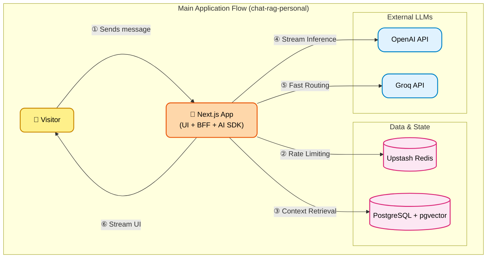

<div align="center">
  
  <h1>mAIo Assistant Chat</h1>
  <p><strong>The ultimate interactive portfolio experience guided by Artificial Intelligence.</strong></p>

  []()
  []()
  []()
  []()
  
  <br />
  <a href="https://maio.maioli.dev.br" target="_blank"><strong>🔗 Access mAIo Assistant Chat live</strong></a>
  <br /><br />
   <a href="README.md">English (en-US)</a> |  <a href="README.pt-BR.md">Português (pt-BR)</a> |  <a href="README.es-LA.md">Español (es-LA)</a>
</div>

---

Welcome to **mAIo Assistant Chat**, the interactive portfolio of **Irineu Marcelo Maioli**. More than just a resume page, this project represents a forward-looking vision of how we interact with professional identities online.

Through **mAIo** (Maioli's Portfolio Artificial Intelligence), visitors, recruiters, and developers can converse with an AI trained to present my career trajectory, technical skills, and developed projects in a fluid, intelligent, and dynamic way. The goal is to transform the passive reading of a resume into an immersive and responsive experience.

## 🌟 Why mAIo?

The current technological landscape demands more than functional solutions; it demands memorable experiences. The mAIo Assistant Chat was designed to prove that the combination of **modern software engineering, exceptional design, and Artificial Intelligence** can create interfaces that don't just inform, but enchant.

### For Recruiters and Reviewers

This project is the materialization of advanced Full-Stack Development skills. From orchestrating vector databases (`pgvector`) for semantic search to building a responsive and internationalized UI (`next-intl`), mAIo demonstrates maturity in stack selection, software architecture, security (Rate Limiting), and observability (Sentry).

## ✨ Current Features

- **💬 Conversational Chat:** Interact with pre-defined topics that trigger AI-generated responses with a *streaming* effect (real-time typing) for an organic experience.
- **🌍 Full Internationalization:** Native support for English, Portuguese, and Spanish, ensuring global accessibility.
- **🛡️ Telemetry Dashboard (Admin):** A restricted and protected area (`/system`) that monitors and audits user interactions with the assistant in real time.
- **⚡ Smart Rate Limiting:** Abuse protection implemented directly at the middleware level using Upstash Redis.

## 🚀 Vision & Roadmap

mAIo is currently in version 1.0.0. The long-term vision is to transform it into a complete cognitive assistant. Upcoming iterations will bring:

- **Free-text Input Field:** Allow users to ask any question about my career, and the assistant will fetch context via RAG (Retrieval-Augmented Generation) to formulate precise answers.
- **Voice Commands and Audio Interaction:** Break the screen barrier by talking to the portfolio using your voice.
- **Deep LLM Integration:** Frictionless model switching to generate even more natural, less robotic conversations.
- **Animated Assistant:** Implementation of an interactive 3D or 2D animated avatar that gestures and reacts according to the chat responses, taking immersion to the next level.

---

## 🛠️ Architecture and Tech Stack

The project was built on a modern, scalable architecture, designed for developers who wish to understand or contribute to the ecosystem:

- **Core & UI:** [Next.js 14+ (App Router)](https://nextjs.org/) + [React](https://react.dev/) + [Tailwind CSS](https://tailwindcss.com/)
- **Language:** Strict [TypeScript](https://www.typescriptlang.org/) for type safety
- **AI & Streaming:** [Vercel AI SDK](https://sdk.vercel.ai/docs)
- **Database & ORM:** [PostgreSQL](https://www.postgresql.org/) (with `pgvector` for Embeddings) + [Prisma](https://www.prisma.io/)
- **Cache & Security:** [Upstash Redis](https://upstash.com/)
- **Admin Auth:** [NextAuth.js v5](https://authjs.dev/)
- **Monitoring:** [Sentry](https://sentry.io/)

### 🏗️ Enterprise Architecture (C4 Model)

This diagram illustrates the core boundaries and responsibilities of the main application, acting as the primary brain orchestrating context retrieval and AI interactions.



---

## 💻 For Developers and Contributors

If you want to explore the code, clone the project, or run the local environment, the setup process was designed to be friendly and straightforward.

### Prerequisites

- Node.js (v18+)
- Docker and Docker Compose (for the database and Redis)
- Git

### Installation Step-by-Step

1. **Clone the Repository:**

   ```bash
   git clone https://github.com/irineumaioli/chat-rag-personal.git
   cd chat-rag-personal
   ```

2. **Install Dependencies:**

   ```bash
   npm install
   ```

3. **Start the Containers (PostgreSQL and Redis):**
   Ensures your local environment has the databases ready to use.

   ```bash
   docker compose up -d
   ```

4. **Configure Environment Variables:**
   Create a `.env` file setting the essential keys:
   - `DATABASE_URL` (Your PostgreSQL connection string)
   - `UPSTASH_REDIS_REST_URL` & `UPSTASH_REDIS_REST_TOKEN` (For Rate Limiting)
   - `AUTH_SECRET` and Admin Credentials

5. **Prepare the Database (Prisma):**

   ```bash
   npx prisma generate
   npx prisma db push
   ```

6. **Start the Development Server:**

   ```bash
   npm run dev
   ```

   *Access [http://localhost:3000](http://localhost:3000) and interact with the assistant! The system will automatically adjust the language based on your browser's locale.*

---

## 📄 License and Contact

This is a personal project created for portfolio demonstration.

**Irineu Marcelo Maioli**  
`<Full-Stack Engineer>`

- [LinkedIn](https://linkedin.com/in/irineumaioli)
- [Email](mailto:irineu_marcelo@outlook.com)

*"Building tomorrow, one line of code at a time."*
