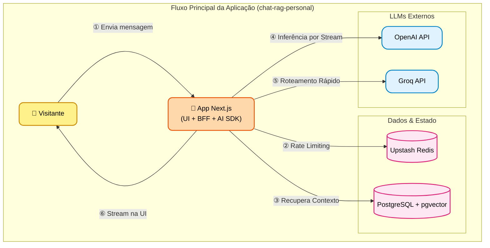

<div align="center">
  
  <h1>mAIo Assistant Chat</h1>
  <p><strong>A experiência definitiva de portfólio interativo guiado por Inteligência Artificial.</strong></p>

  []()
  []()
  []()
  []()
  
  <br />
  <a href="https://maio.maioli.dev.br" target="_blank"><strong>🔗 Acesse o mAIo Assistant Chat ao vivo</strong></a>
  <br /><br />
   <a href="README.md">English (en-US)</a> |  <a href="README.pt-BR.md">Português (pt-BR)</a> |  <a href="README.es-LA.md">Español (es-LA)</a>
</div>

---

Bem-vindo ao **mAIo Assistant Chat**, o portfólio interativo de **Irineu Marcelo Maioli**. Mais do que uma simples página de currículo, este projeto representa uma visão de futuro sobre como interagimos com identidades profissionais online. 

Através do **mAIo** (Inteligência Artificial do Portfólio Maioli), visitantes, recrutadores e desenvolvedores podem conversar com uma IA treinada para apresentar de forma fluida, inteligente e dinâmica a minha trajetória, habilidades técnicas e projetos desenvolvidos. O objetivo é transformar a leitura passiva de um currículo em uma experiência imersiva e responsiva.

## 🌟 Por que o mAIo?

O cenário tecnológico atual exige mais do que soluções funcionais; exige experiências memoráveis. O mAIo Assistant Chat foi desenhado para provar que a combinação entre **engenharia de software moderna, design excepcional e Inteligência Artificial** pode criar interfaces que não apenas informam, mas encantam.

### Para Avaliadores e Recrutadores
Este projeto é a materialização de competências avançadas em Full-Stack Development. Da orquestração de banco de dados vetoriais (`pgvector`) para buscas semânticas, até a construção de uma UI responsiva e internacionalizada (`next-intl`), o mAIo demonstra maturidade na escolha do stack, arquitetura de software, segurança (Rate Limiting) e observabilidade (Sentry).

## ✨ Funcionalidades Atuais

- **💬 Chat Conversacional:** Interaja com tópicos pré-definidos que disparam respostas geradas por IA, com efeito de *streaming* (digitação real) para uma experiência orgânica.
- **🌍 Internacionalização Completa:** Suporte nativo a Português, Inglês e Espanhol, garantindo acessibilidade a oportunidades globais.
- **🛡️ Painel de Telemetria (Admin):** Uma área restrita e protegida (`/system`) que monitora e audita em tempo real as interações dos usuários com o assistente.
- **⚡ Rate Limiting Inteligente:** Proteção contra abusos implementada diretamente no middleware utilizando Upstash Redis.

## 🚀 Visão de Futuro (Roadmap)

O mAIo está apenas em sua versão 1.0.0. A visão a longo prazo é transformá-lo em um assistente cognitivo completo. As próximas iterações trarão:

- **Campo de Texto Livre:** Permita que os usuários façam qualquer pergunta sobre minha carreira, e o assistente buscará o contexto via RAG (Retrieval-Augmented Generation) para formular respostas precisas.
- **Comandos e Interações por Voz (Áudio):** Quebre a barreira da tela conversando com o portfólio usando a voz.
- **Integração Profunda com LLMs:** Troca de modelos sem atrito para gerar conversas ainda mais naturais e menos robotizadas.
- **Assistente Animado:** Implementação de um avatar 3D ou 2D interativo e animado que gesticule e reaja de acordo com as respostas do chat, elevando a imersão ao próximo nível.

## 📁 Estrutura do Projeto

Este projeto segue uma estrutura modular e escalável utilizando o App Router do Next.js:

```text
chat-rag-personal/
├── src/
│   ├── app/                         # Roteamento principal, páginas e endpoints de API (BFF)
│   │   ├── api/chat/                # Endpoint principal para processar interações com a IA e streaming
│   │   ├── system/                  # 🛡️ Painel de Telemetria (monitorar, verificar, auditar interações)
│   │   └── [locale]/                # Rotas dinâmicas para internacionalização (en-US, pt-BR, es-LA)
│   ├── components/                  # Componentes React reutilizáveis (UI, chat, dashboard admin)
│   ├── actions/                     # Server Actions para submissões de formulários e mutações de dados
│   └── i18n/                        # Configurações de internacionalização e dicionários de tradução
├── prisma/                          # Definição do schema do banco de dados (schema.prisma) e migrações
├── backend/                         # Lógica de negócios central, serviços e clientes de banco de dados
├── package.json                     # Dependências do projeto e scripts
└── tsconfig.json                    # Configuração do TypeScript
```

---

## 🛠️ Arquitetura e Tecnologias

O projeto foi construído sobre uma arquitetura moderna e escalável, pensada para desenvolvedores que desejam entender ou contribuir com o ecossistema:

- **Core & UI:** [Next.js 14+ (App Router)](https://nextjs.org/) + [React](https://react.dev/) + [Tailwind CSS](https://tailwindcss.com/)
- **Linguagem:** [TypeScript](https://www.typescriptlang.org/) rigoroso para segurança de tipos
- **IA e Streaming:** [Vercel AI SDK](https://sdk.vercel.ai/docs)
- **Banco de Dados & ORM:** [PostgreSQL](https://www.postgresql.org/) (com `pgvector` para Embeddings) + [Prisma](https://www.prisma.io/)
- **Cache & Segurança:** [Upstash Redis](https://upstash.com/)
- **Autenticação Admin:** [NextAuth.js v5](https://authjs.dev/)
- **Monitoramento:** [Sentry](https://sentry.io/)

### 🏗️ Arquitetura Corporativa (C4 Model)

Este diagrama ilustra as fronteiras centrais e responsabilidades da aplicação principal, atuando como o cérebro primário que orquestra a recuperação de contexto e as interações com a IA.



---

## 💻 Para Desenvolvedores e Contribuidores

Se você deseja explorar o código, clonar o projeto ou rodar o ambiente local, o processo de setup foi desenhado para ser amigável e direto.

### Pré-requisitos
- Node.js (v18+)
- Docker e Docker Compose (para banco de dados e Redis)
- Git

### Passo a Passo da Instalação

1. **Clone o Repositório:**
   ```bash
   git clone https://github.com/irineumaioli/chat-rag-personal.git
   cd chat-rag-personal
   ```

2. **Instale as Dependências:**
   ```bash
   npm install
   ```

3. **Suba os Containers (PostgreSQL e Redis):**
   Garante que o ambiente local tenha os bancos de dados prontos para uso.
   ```bash
   docker compose up -d
   ```

4. **Configure as Variáveis de Ambiente:**
   Crie um arquivo `.env` configurando as chaves essenciais:
   - `DATABASE_URL` (Sua conexão com o PostgreSQL)
   - `UPSTASH_REDIS_REST_URL` e `UPSTASH_REDIS_REST_TOKEN` (Para o Rate Limit)
   - `AUTH_SECRET` e Credenciais de Admin

5. **Prepare o Banco de Dados (Prisma):**
   ```bash
   npx prisma generate
   npx prisma db push
   ```

6. **Inicie o Servidor de Desenvolvimento:**
   ```bash
   npm run dev
   ```
   *Acesse [http://localhost:3000](http://localhost:3000) e interaja com o assistente! O sistema ajustará o idioma automaticamente baseado no seu navegador.*

---

## 📄 Licença e Contatos

Este é um projeto pessoal criado para demonstração de portfólio. 

**Irineu Marcelo Maioli**  
`<Full-Stack Engineer>`

- [LinkedIn](https://linkedin.com/in/irineumaioli)
- [Email](mailto:irineu_marcelo@outlook.com)

*"Construindo o amanhã, uma linha de código por vez."*
